# Immunisation Demand Module - System Design Guide { #imm-dm-design }

## Introduction

The DHIS2 Module for Immunisation Demand is designed to support countries in systematically monitoring and analysing demand-related determinants of vaccination uptake, with a particular focus on behavioural, social, and practical factors influencing the use of immunisation services. This module has been developed at the request of EPI Managers for stronger partner support to Ministries of Health to operationalize continuous and harmonized demand monitoring within existing health information systems.

The module reflects a bottom-up approach whereby UNICEF ESARO sourced existing demand M&E indicators from countries to inform the Implementation Monitoring Framework on which the DHIS2 Module is based. This framework prioritizes demand-related indicators already used and validated by countries, incorporates indicators identified through Expanded Programme on Immunization (EPI) Manager consultations, and is complemented by global SBC indicators, donor reporting requirements, and selected BeSD measures. In addition, the module is guided by the [WHO Behavioural and Social Drivers of Vaccination (BeSD): Tools and practical guidance for achieving high uptake guidelines (WHO, 2022)](https://www.who.int/publications/i/item/9789240049680), which provide the conceptual framework for understanding and categorising the drivers of vaccine demand. These guidelines serve as a normative reference for the definition and interpretation of demand-related constructs within the module.

By consolidating these sources, the module promotes alignment across global and country monitoring expectations while reducing the reporting burden on countries. It enables the systematization of multiple data needs within a single platform, minimizing the need for parallel tools and strengthening the coherence of demand monitoring.

Building on this conceptual foundation, the Demand Module operationalizes demand-related monitoring through a defined set of indicators developed in collaboration with UNICEF, with a focus on routine use within immunisation programmes. The indicator set including definitions, periodicity, and level of data collection constitutes the primary technical reference for the module and is the main driver of the DHIS2 system design described in this document.

This module includes:
- A standardized set of demand-related indicators covering key domains such as vaccination intention, confidence, social influence, access, and service experience.
- Data generated through the module — including datasets and dashboards — will be disaggregated by sex, province/region, and district to enable deeper analysis that informs decision-making, programming, targeted actions, and timely course corrections.
- Reference analytical outputs to support routine monitoring of demand patterns and identification of barriers contributing to under-vaccination and zero-dose populations
- Aggregate datasets and indicators designed to enable performant, anonymized analytics and longitudinal trend analysis within DHIS2
- Example dashboard visualizations to facilitate interpretation of demand-related data and triangulation with immunisation coverage and service delivery information

The DHIS2 Demand Module aims to strengthen the systematic use of demand-side data in immunisation programmes by improving visibility of non-supply determinants of uptake, supporting evidence-informed planning, and enabling targeted response actions. The module is designed to complement existing immunisation information systems and coverage monitoring by providing a structured and adaptable approach to analysing demand-related factors.

This system design document describes the reference configuration of the Demand Module in DHIS2, including the indicator logic, aggregate data structures, and analytical dashboards. It explains how the module can be configured and used to support routine analysis, programme review, and decision-making.

This document does not cover the resources or infrastructure required to implement the system, such as server hosting, connectivity, training, or user support. Guidance on these aspects is provided in the DHIS2 Implementation Guide.

Reference metadata for this module will be made available through the [DHIS2 metadata distribution channels](https://dhis2.org/metadata-downloads/).

## Acknowledgement

The DHIS2 Demand Module for Immunisation was supported by GAVI and developed in collaboration with UNICEF, with inputs from country programmes and technical partners who contributed to the design and validation of demand-related indicators and analyses.
We also thank the countries and implementers who shared their experience and feedback during the development process.

## Background

Despite the availability of safe and effective vaccines, many countries continue to face persistent gaps in immunisation coverage. These gaps are not solely driven by supply-side constraints, but also by behavioural, social, and practical factors that influence caregivers’ and individuals’ decisions and ability to access vaccination services. Such demand-related barriers contribute to under-vaccination, delayed vaccination, and the persistence of zero-dose and missed populations.

Evidence shows that factors such as low confidence in vaccines, weak social support for vaccination, limited intention or motivation, and practical barriers related to access, affordability, and service experience can significantly affect vaccine uptake. These factors often vary across populations and geographies and may change over time, underscoring the need for systematic and routine monitoring alongside coverage and service delivery data.

Global guidance highlights the importance of understanding and addressing these demand-side determinants to improve immunisation performance and equity. The WHO Behavioural and Social Drivers of Vaccination (BeSD) framework provides a structured approach for conceptualising and measuring these drivers, while immunisation programmes increasingly seek to integrate demand-related indicators into routine health information systems to inform planning, targeting, and evaluation of interventions.

In this context, immunisation programmes can leverage existing DHIS2 platforms to strengthen the routine monitoring of demand-related indicators at multiple levels of the health system. By integrating demand data into national immunisation information systems, countries can complement coverage and service data, improve triangulation, and better identify populations and areas where demand-related barriers are contributing to low uptake.

This System Design Guide presents a DHIS2-based approach for monitoring immunisation demand, focusing on aggregate indicators related to behavioural, social, and practical drivers of vaccination. It provides a reference configuration to support consistent data collection, analysis, and use for programme review and decision-making at subnational and national levels.

### Intended users

The DHIS2 Demand Module system design is intended to meet the needs of users involved in the planning, monitoring, and improvement of immunisation programmes at all levels of the health system. This guide may be used as a reference for training immunisation data users on the interpretation and use of demand-related indicators, as well as for training data entry staff responsible for routine data capture.
Intended users include:
- **Immunisation programme managers, health promotion managers  and staff (national and subnational)**: data users responsible for routine analysis of demand-related indicators, triangulation with coverage and service data, and use of evidence to inform programme planning, targeting of interventions, and feedback to implementing partners and service delivery points
- **Immunisation data managers and M&E officers**: users responsible for overseeing data collection, data quality, indicator calculation, analysis, and reporting related to immunisation demand within DHIS2
- **System administrators and HMIS focal points**: Ministry of Health staff and/or core DHIS2 teams responsible for system configuration and maintenance, integration of demand-related data into national health information platforms, user management, and ongoing technical support
- **Implementing partners**: organizations providing technical assistance to immunisation programmes, supporting data collection and analysis, and using demand-related data to inform programme implementation and adaptive strategies

## Design structure

The DHIS2 Demand Module configuration is structured around two main components:
- **Dashboards and indicators**: Demand-related dashboards and indicators are implemented using the aggregate data model in DHIS2. Indicators are derived from a defined set of aggregate data elements and are designed to support routine monitoring of behavioural, social, and practical drivers of immunisation uptake. The dashboards provide standardized analytical views to support programme review, trend analysis, and triangulation with immunisation coverage and service delivery data.
- **Aggregate datasets**: Aggregate datasets and data elements are configured based on the defined demand indicator framework to populate the core indicators used in the module. These datasets are designed to support performant analytics by leveraging the DHIS2 aggregate data model. They can be used to:
  - Capture aggregated demand-related data collected through routine reporting processes
  - Store aggregated outputs from survey-based or individual-level data collection activities for routine analysis
  - Integrate summarized data from external systems or tools used for demand data collection

The aggregate datasets are designed to be flexible and adaptable, allowing countries to use them either as primary reporting tools or as aggregation layers for data originating from other sources, while maintaining consistency in indicator calculation and analysis.

### Dashboard

Thematic dashboards for monitoring immunisation demand have been developed based on the core demand-related indicators defined for the DHIS2 Demand Module. The dashboards are designed to support routine analysis of behavioural, social, and practical drivers of vaccination uptake, and to facilitate interpretation of demand-related patterns alongside immunisation programme data.

Standard dashboard visualizations are provided as part of the reference configuration and can be rendered at national or subnational levels depending on user access and organisational unit configuration. The dashboards present indicator trends and distributions that support identification of demand-related barriers, comparison across geographic areas and population groups, and monitoring of changes over time.

The dashboards are fully served by DHIS2 indicators, as described in the following section, and rely on the aggregate data model for performance and scalability.

The dashboard visualizations presented in this document have been developed using dummy data and are intended for illustrative purposes only. Screenshots shown may include example organisational unit names and geographic maps used in the DHIS2 demonstration instance.

Two dashboard configurations are included in this module to support different analytical needs:
- **National-level dashboard**, designed for programme oversight and strategic review
- **Subnational-level dashboard**, designed for district-level and operational analysis

To enhance usability, selected explanation boxes are embedded throughout the dashboards to guide interpretation, highlight key insights, and suggest next steps. These boxes also point users to relevant resources to strengthen data use, supporting more informed decision-making, targeted actions, and continuous programme improvement.

#### Intention vs Uptake

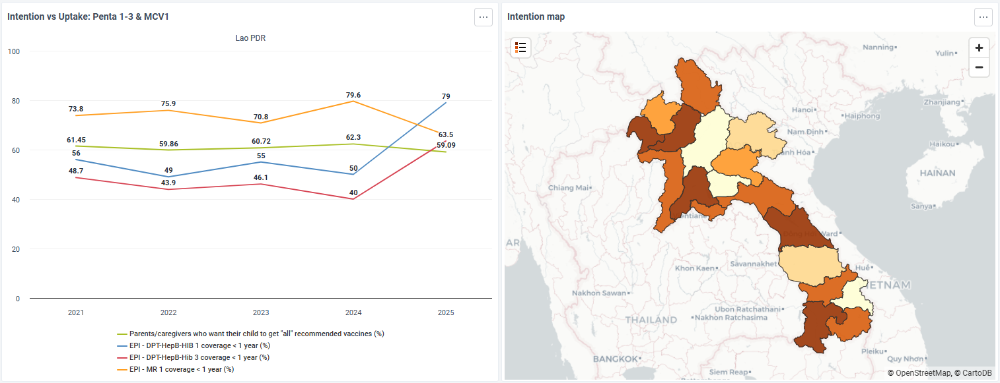

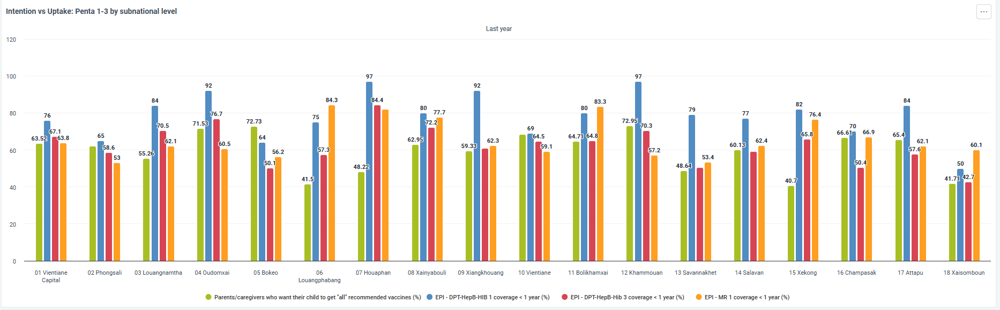

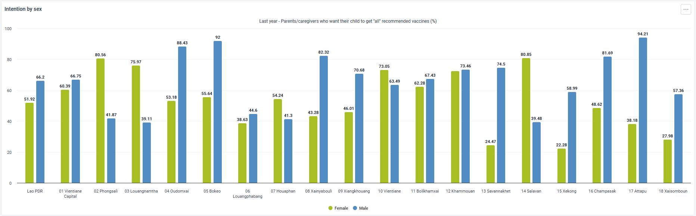

When intention > coverage: points to barriers beyond motivation (e.g., access, service experience, decision making power)

#### Intention vs Social Norms vs Vaccine Safety

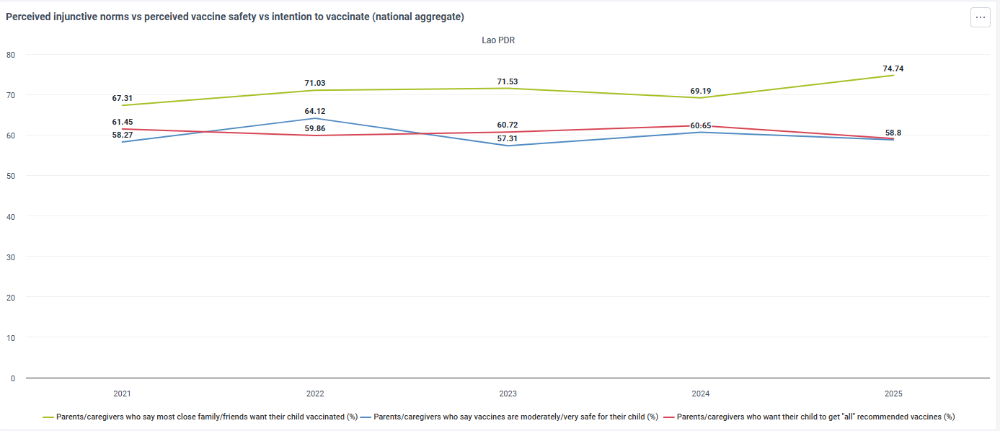

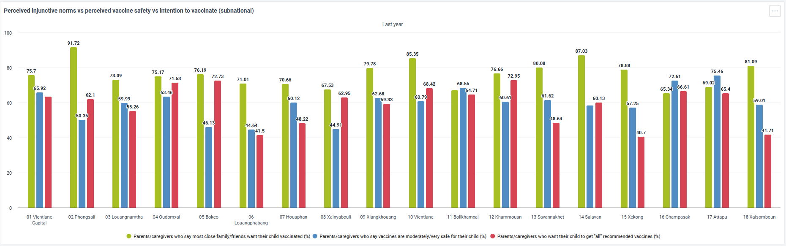

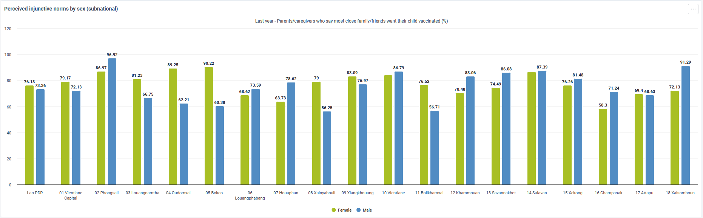

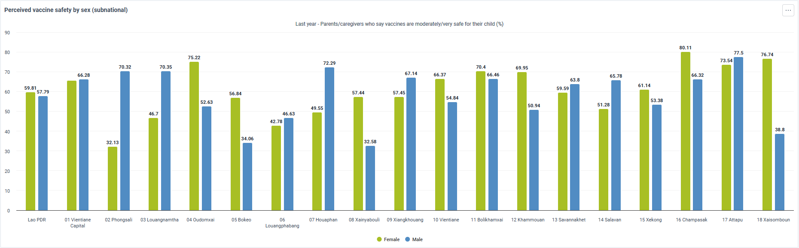

Large subnational variation, consistently low indicators, weak confidence, limited social support, and female–male gaps may signal context-specific behavioural and social barriers affecting vaccination uptake. Identify priority populations and locations for deeper analysis.

#### Service Experience vs Drop Out / Service Experience vs Coverage

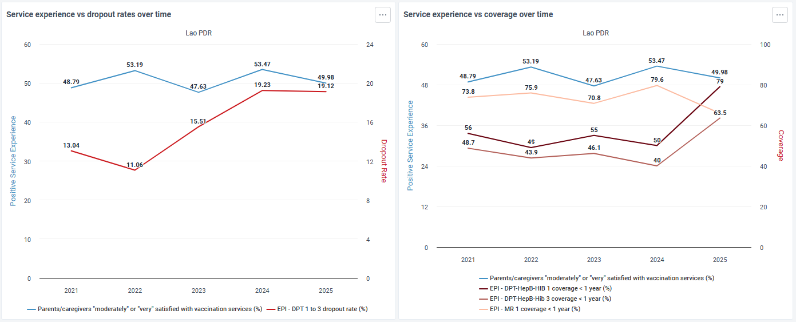

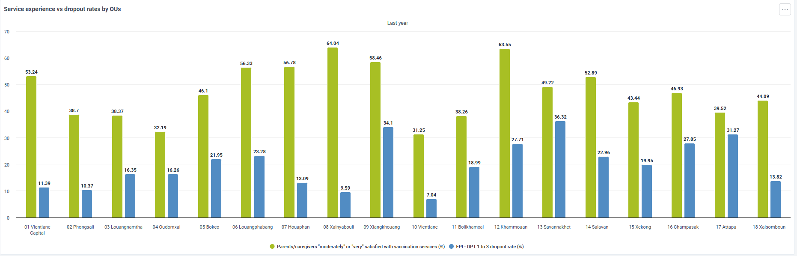

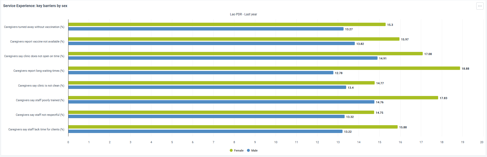

Trends in service experience should be interpreted alongside dropout and coverage to identify potential facility-level, behavioural, or access-related barriers affecting immunisation outcomes, while large subnational variations may signal uneven service delivery. Further analyses disaggregated by sex are recommended to understand disparities, triangulate findings with behavioural insights, reported barriers, and supply-side data, and conduct statistical correlation where feasible to better determine root causes.

#### Practical Barriers

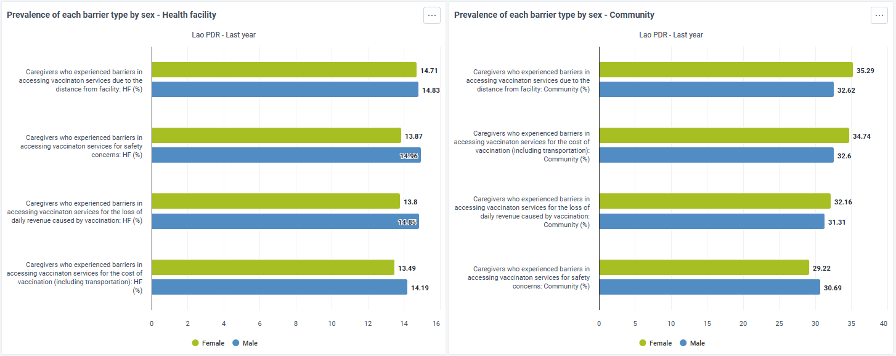

Review the prevalence of reported barriers at both health facility and community levels to understand what may be limiting access to vaccination. Compare female–male differences to detect gender-related disparities, and assess which barriers are most common to help distinguish whether challenges are primarily financial, geographic, safety-related, or linked to opportunity costs such as lost income.

#### Equity & Inclusion

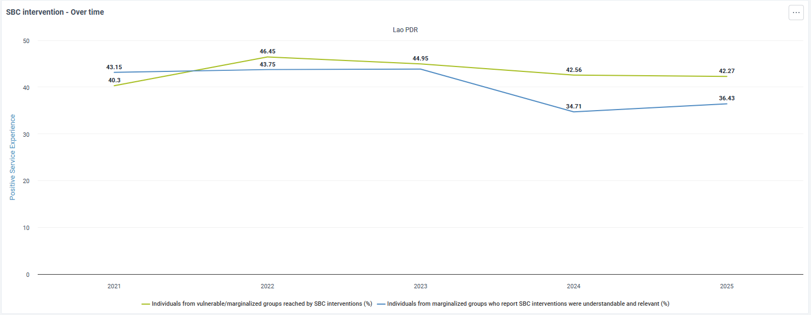

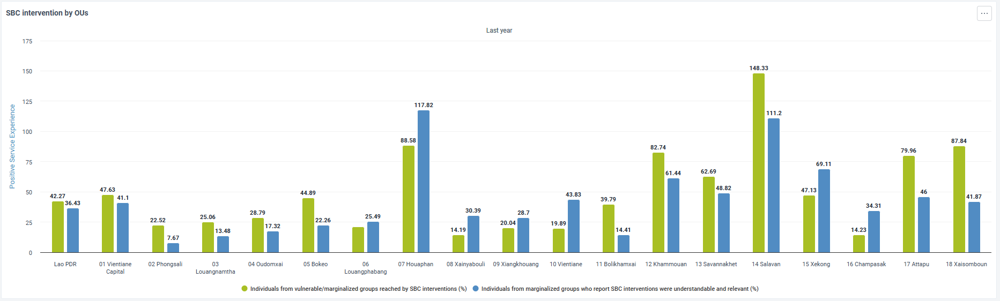

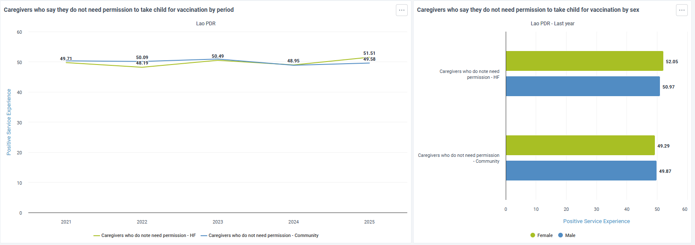

Use these graphs to assess caregivers’ decision-making autonomy and exposure to SBC interventions across locations and population groups. Look for subnational variation and female–male differences to identify where permission requirements or limited agency may restrict vaccination, and review trends over time to understand whether autonomy is improving.

### Data Sets

As described above, dashboards in the DHIS2 Demand Module are populated using the aggregate data model and DHIS2 indicators. Aggregate datasets, data elements, and category combinations are configured to support the analytical dimensions defined by the demand indicator framework, including behavioural, social, and practical drivers of immunisation uptake.

These datasets can be used for aggregate reporting in settings that do not use DHIS2 Tracker, or where demand-related data are collected through other individual-level tools and reported routinely in aggregated form. They may also serve as landing datasets for summarized data originating from external systems, surveys, or digital data collection platforms.

The Demand Module includes multiple datasets designed to reflect both the **periodicity of data collection** and the **level at which information is generated**, ensuring flexibility across different country implementation models.

#### Dataset structure and periodicity

A total of nine (9) datasets are included in the reference configuration, distributed across national, health facility, and community levels:
- **National level**
  - National – Semi-annual
  - National – Annual
- **Health facility level**
  - Health Facility – Monthly
  - Health Facility – Quarterly
  - Health Facility – Semi-annual
  - Health Facility – Annual
- **Community level**
  - Community – Monthly
  - Community – Quarterly
  - Community – Semi-annual

This structure allows demand-related information to be reported at the most appropriate level and frequency, depending on the source of the data and programme needs.

#### Implementation considerations

Depending on the country context and health system hierarchy, community-level information may be:
- Reported through dedicated community datasets, or
- Integrated into health facility datasets, either through organisational unit hierarchy design or by using category combinations to distinguish the source of information.

Datasets may be used directly for data entry or as aggregation layers to receive data from multiple systems, including survey platforms or other individual-level data collection tools.

In addition, an individual-level DHIS2 data model (event or tracker-based) can be configured to collect data directly from individual respondents. In such cases, the aggregate data model can be used as an analytical and exchange layer, enabling performant, anonymized analysis while preserving flexibility in data collection approaches.

## User groups

| **User group**           | **Metadata**        | **Data**                 |
| --------------------- | ----------------- | -------------------- |
| IMM DM - Admin        | Can edit and view | No Access            |
| IMM DM - Access       | Can view only     | Can view only        |
| IMM DM - Data Capture | Can view only     | Can capture and view |

## References

WHO Behavioural and Social Drivers of Vaccination (BeSD): Tools and practical guidance for achieving high uptake guidelines (WHO, 2022) https://www.who.int/publications/i/item/9789240049680

UNICEF. Menu of Social and Behaviour Change Results and Indicators. SBC Guidance Platform. Available at: https://dev.sbcguidance.org/understand/sbc-menu-results-and-indicators

UNICEF. Embedding Social and Behavioural Change (SBC) Approaches in National Immunization Strategies (NIS) to Promote Demand and Uptake – A Supplement to NIS Guidance. New York: UNICEF.
